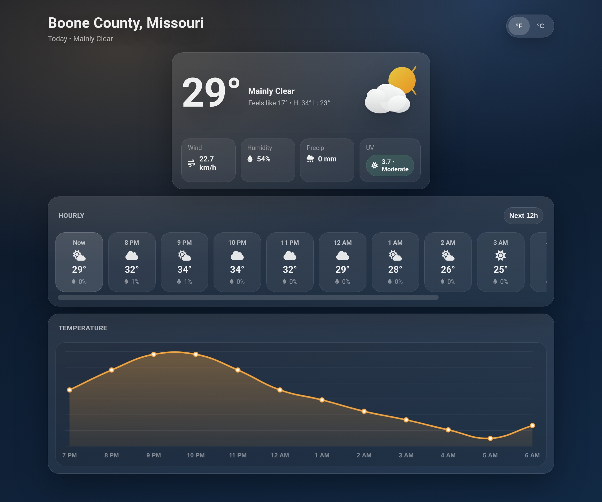

# Weather Page

<p align="center">
  
</p>

<p align="center">
  
  
  
</p>

A simple web application that displays current weather conditions based on your location.

## Features

- Automatic location detection using browser geolocation
- Real-time weather data from Open-Meteo API
- Temperature display with unit conversion (Celsius/Fahrenheit)
- Auto-refresh to keep weather data current
- 12-hour forecast with hourly breakdown
- Temperature trend chart visualization
- UV index with severity levels
- Wind speed, humidity, and precipitation stats
- Feels like temperature and daily high/low
- Location name via reverse geocoding
- Responsive mobile-friendly design

## Tech Stack

- **Node.js / Express** - Backend server
- **Open-Meteo API** - Weather data
- **Nominatim API** - Reverse geocoding for location names
- **Chart.js** - Temperature visualization
- **Font Awesome** - Icons

## Setup

1. Install dependencies:
   ```bash
   npm install
   ```

2. Start the server:
   ```bash
   node index.js
   ```

3. Open your browser and navigate to `http://localhost:3000`

## Usage

The application will request permission to access your location. Once granted, it will automatically fetch and display the current weather conditions for your area.

## API

The server exposes a `/weather` endpoint that accepts `latitude` and `longitude` query parameters:

```
GET /weather?latitude=40.7128&longitude=-74.0060
```
